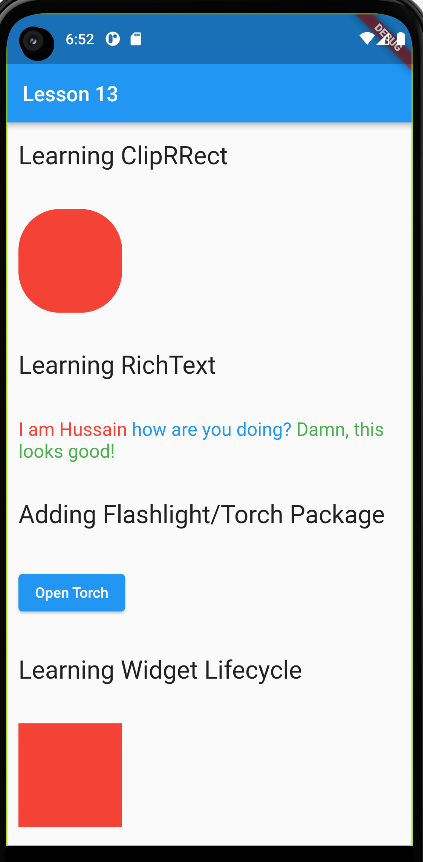

# Lesson #13

Learning about Clipping, ClipRRect, RichText - learning to integrate packages like Torch/Flashlight.
Learning about Stateful Widget Lifecycle
createState, initState, didChangeDependencies, build, didUpdateWidget, deactivate, dispose and learning about mounted property

